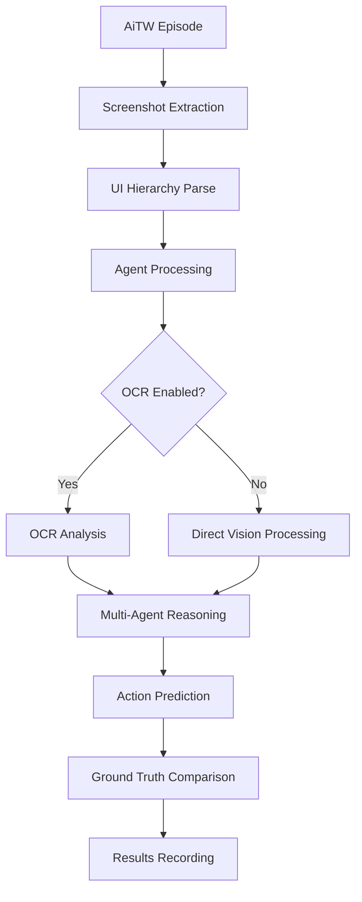
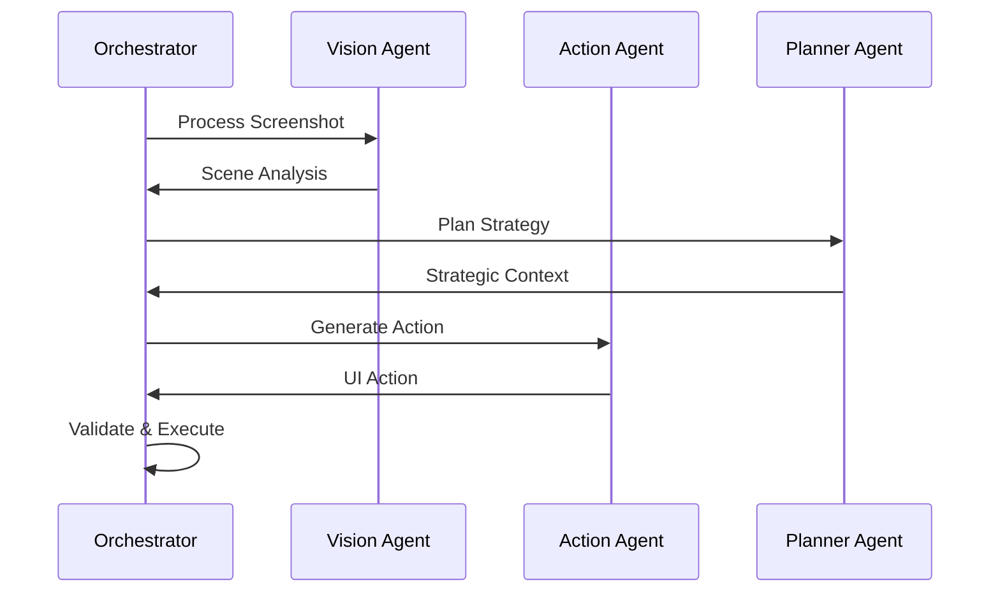

# System Architecture

This document provides an overview of the MMLLM system architecture, including the multi-agent framework, OCR integration, and evaluation pipeline.

## Overview

MMLLM is a multi-modal language learning model designed for Android in the Wild (AiTW) dataset evaluation. The system combines computer vision, natural language processing, and structured reasoning to interact with Android user interfaces.

## High-Level Architecture

```
┌─────────────────────────────────────────────────────────────┐
│                    MMLLM System                             │
├─────────────────────────────────────────────────────────────┤
│  ┌─────────────────┐  ┌─────────────────┐  ┌──────────────┐ │
│  │   Data Layer    │  │  Agent Layer    │  │ Eval Layer   │ │
│  │                 │  │                 │  │              │ │
│  │ • AiTW Dataset  │  │ • Multi-Agent   │  │ • Benchmark  │ │
│  │ • Screenshots   │  │ • OCR Module    │  │ • Metrics    │ │
│  │ • Ground Truth  │  │ • LLM Backend   │  │ • Reports    │ │
│  └─────────────────┘  └─────────────────┘  └──────────────┘ │
└─────────────────────────────────────────────────────────────┘
```

## Core Components

### 1. Data Layer

#### Android in the Wild Dataset
- **Source**: TensorFlow Datasets
- **Content**: Screenshots, UI hierarchies, ground truth actions
- **Datasets**: general, google_apps, install, single, web_shopping
- **Format**: Episodic structure with step-by-step interactions

#### Data Processing Pipeline
```python
Episode Structure:
├── screenshots/          # UI screenshots for each step
├── ui_hierarchy/         # Android view hierarchy
├── ground_truth_actions/ # Expected user actions
└── metadata/             # Episode metadata
```

### 2. Agent Layer

#### Multi-Agent Architecture

The system employs a multi-agent approach with specialized agents:

```
┌─────────────────────────────────────────────────┐
│                Agent Orchestrator                │
├─────────────────────────────────────────────────┤
│  ┌─────────────┐  ┌─────────────┐  ┌─────────────┐ │
│  │ Vision Agent│  │ Action Agent│  │ Planner     │ │
│  │             │  │             │  │ Agent       │ │
│  │ • OCR       │  │ • UI Parsing│  │ • Strategy  │ │
│  │ • Scene     │  │ • Action    │  │ • Reasoning │ │
│  │   Analysis  │  │   Selection │  │ • Context   │ │
│  └─────────────┘  └─────────────┘  └─────────────┘ │
└─────────────────────────────────────────────────────┘
```

#### Vision Agent
- **OCR Integration**: Text extraction from UI elements
- **Scene Understanding**: Layout and component recognition
- **Visual Grounding**: Mapping visual elements to actions

#### Action Agent
- **UI Element Detection**: Identifying interactive components
- **Action Planning**: Determining appropriate interactions
- **Coordinate Mapping**: Converting UI elements to screen coordinates

#### Planner Agent
- **Goal Decomposition**: Breaking down complex tasks
- **Strategy Selection**: Choosing optimal interaction patterns
- **Context Management**: Maintaining state across steps

### 3. OCR Module

#### Architecture

```
┌─────────────────────────────────────────────────┐
│                 OCR Pipeline                    │
├─────────────────────────────────────────────────┤
│  ┌─────────────┐  ┌─────────────┐  ┌─────────────┐ │
│  │ Preprocessing│  │ Text        │  │ Post-       │ │
│  │             │  │ Detection   │  │ processing  │ │
│  │ • Resizing  │  │             │  │             │ │
│  │ • Filtering │  │ • OCR Engine│  │ • Cleanup   │ │
│  │ • Enhancement│  │ • Confidence│  │ • Validation│ │
│  └─────────────┘  └─────────────┘  └─────────────┘ │
└─────────────────────────────────────────────────────┘
```

#### Integration Points
- **Input**: Screenshots from Android episodes
- **Output**: Structured text with bounding boxes
- **Usage**: Enhanced UI understanding and element identification

### 4. LLM Backend

#### Model Support
- **OpenAI GPT Models**: GPT-4, GPT-4 Turbo, GPT-4 Omni Mini
- **Azure OpenAI**: Enterprise-grade deployment
- **Model Selection**: Configurable via environment variables

#### Prompt Engineering
- **Standard Prompts**: General-purpose interaction patterns
- **Android Tree Prompts**: UI hierarchy-aware prompting
- **Context Management**: Multi-turn conversation handling

### 5. Evaluation Layer

#### Benchmark Pipeline
```
Episode Input → Agent Processing → Action Prediction → Evaluation → Results
     ↓              ↓                  ↓                ↓           ↓
Screenshots    Multi-Agent        UI Actions      Ground Truth   Metrics
UI Data        Analysis           Coordinates     Comparison     Reports
```

#### Metrics and Scoring
- **Action Accuracy**: Correctness of predicted actions
- **Sequence Alignment**: Step-by-step comparison
- **Success Rate**: Episode completion percentage
- **Error Classification**: Categorized failure analysis

## Data Flow

### 1. Episode Processing Flow



### 2. Agent Communication Flow



## Configuration Management

### Environment Configuration
```env
# Model Configuration
AZURE_DEPLOYMENT=o4-mini
OPENAI_API_KEY=sk-...

# Feature Flags
OCR_ENABLED=true
ANDROID_TREE_PROMPTS=false
IMAGE_HISTORY=false

# Performance Settings
MAX_WORKERS=8
BATCH_SIZE=5
```

### Agent Configuration
```json
{
  "agent_config": {
    "ocr_module": true,
    "prompt_strategy": "android_tree",
    "image_history": true,
    "max_steps": 10
  },
  "evaluation_config": {
    "datasets": ["general", "google_apps"],
    "episode_range": {"start": 0, "end": 10},
    "output_format": ["csv", "json"]
  }
}
```

## Performance Characteristics

### Scalability
- **Horizontal Scaling**: Multi-worker parallel processing
- **Batch Processing**: Configurable batch sizes for optimization
- **Resource Management**: Dynamic worker allocation

### Latency Profile
- **Screenshot Processing**: 100-500ms
- **OCR Analysis**: 200-800ms
- **LLM Inference**: 1-5 seconds
- **Total per Step**: 2-8 seconds

### Resource Requirements
- **Memory**: 4-16GB depending on configuration
- **CPU**: Multi-core for parallel processing
- **Network**: Stable connection for API calls
- **Storage**: 5-50GB for datasets and results

## Integration Points

### External APIs
- **OpenAI/Azure OpenAI**: LLM inference
- **TensorFlow Datasets**: Dataset access
- **Tavily Search**: Web search capabilities
- **LangSmith**: Tracing and monitoring

### Output Interfaces
- **CSV Reports**: Structured result data
- **JSON APIs**: Programmatic access
- **Visualization Tools**: Charts and graphs
- **Log Files**: Detailed execution traces

## Security Considerations

### API Key Management
- **Environment Variables**: Secure key storage
- **Access Control**: Restricted API permissions
- **Rate Limiting**: Respect provider limits

### Data Privacy
- **Local Processing**: Screenshot analysis on local machine
- **API Transmission**: Only processed features sent to APIs
- **Result Storage**: Configurable output locations

## Extension Points

### Custom Agents
```python
class CustomAgent(BaseAgent):
    def process_screenshot(self, image):
        # Custom processing logic
        return analysis_result
    
    def generate_action(self, context):
        # Custom action generation
        return ui_action
```

### Custom Evaluators
```python
class CustomEvaluator(BaseEvaluator):
    def evaluate_action(self, predicted, ground_truth):
        # Custom evaluation logic
        return score, metadata
```

### Plugin Architecture
- **OCR Backends**: Pluggable OCR engines
- **LLM Providers**: Multiple model providers
- **Output Formatters**: Custom result formats

## Monitoring and Debugging

### Logging System
- **Structured Logging**: JSON-formatted logs
- **Log Levels**: DEBUG, INFO, WARNING, ERROR
- **Component Tracing**: Per-agent execution traces

### Performance Monitoring
- **Execution Timing**: Step-by-step performance tracking
- **Resource Usage**: Memory and CPU monitoring
- **API Metrics**: Request/response timing and errors

### Debugging Tools
- **Dry Run Mode**: Configuration validation
- **Sequential Mode**: Single-threaded debugging
- **Verbose Output**: Detailed execution information

## Future Architecture Considerations

### Planned Enhancements
- **Real-time Processing**: Live Android device interaction
- **Model Fine-tuning**: Custom model training pipeline
- **Distributed Execution**: Multi-machine processing
- **Advanced OCR**: Document-level understanding

### Scalability Roadmap
- **Cloud Deployment**: Container-based scaling
- **Database Integration**: Persistent result storage
- **API Gateway**: RESTful service interface
- **Monitoring Dashboard**: Real-time system monitoring

## Related Documentation

- [Installation Guide](INSTALLATION.md): Environment setup
- [Benchmarking Guide](BENCHMARKING.md): Using the evaluation system
- [Parallel Benchmarking](PARALLEL_BENCHMARKING.md): High-performance evaluation
- [Utilities Guide](UTILITIES.md): Supporting tools and scripts
